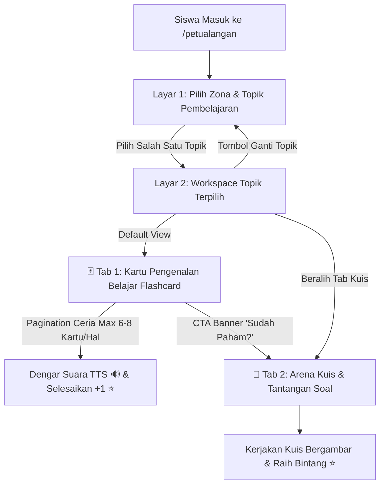
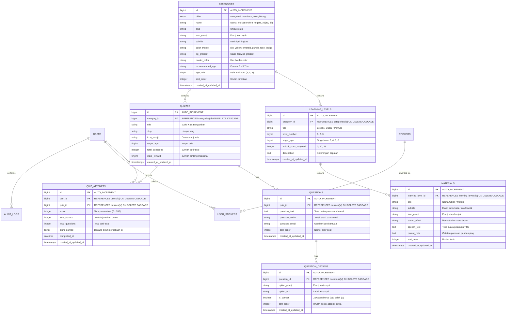

# 📄 Product Requirement Document (PRD)
# Platform Belajar & Kuis Bergambar Interaktif PAUD (Kurikulum 3 Pilar)
**Nama Proyek**: YukBelajar PAUD  
**Target Pengguna**: Anak Usia Dini (PAUD / TK, Usia 3–6 Tahun), Orang Tua / Pendamping, & Guru / Administrator  
**Teknologi Utama**: Laravel 11 (PHP 8.4), Tailwind CSS v4, Alpine.js, Google Gemini AI (Official Package: `google-gemini-php/laravel`)  
**Status**: 100% Gratis, Ramah Anak, & Terbuka  

---

## 1. 📌 Ringkasan Eksekutif (Executive Summary)
**YukBelajar PAUD** adalah platform pembelajaran digital interaktif yang dirancang khusus untuk anak usia dini (3–6 tahun). Platform ini berfokus pada pendekatan **Visual-First dan Audio-Friendly** karena anak PAUD belum lancar membaca teks panjang.

Platform ini dirombak dan diorganisasikan ke dalam **3 Pilar Utama Metode Pembelajaran** (Kurikulum Merdeka PAUD: *Zona Mengenal, Zona Membaca, dan Zona Menghitung*), menggantikan filter usia statis dengan eksplorasi berbasis zona dan tingkatan level alami (*Duolingo-style Star Progression*).

Platform ini terintegrasi penuh dengan **Official Google Gemini AI SDK** khusus untuk **Admin/Guru**, yang secara otomatis menghasilkan **Materi & Soal Bergambar**, **Kuis Interaktif**, dan **Suara Narasi TTS Bahasa Indonesia** berdasarkan Pilar dan Topik yang dipilih dalam satu alur kerja yang mudah.

---

## 2. 🎯 Tujuan Produk & Persona Pengguna

### 2.1. Tujuan Utama
1. **Kurikulum Berbasis 3 Pilar**: Menyediakan struktur pembelajaran terpadu yang mencakup **Mengenal Lingkungan & Dunia**, **Literasi & Fonik Membaca**, serta **Numerasi & Logika Menghitung**.
2. **Eksplorasi Mandiri Ramah Anak**: Memberikan pengalaman belajar 2-tahap (Pilih Zona/Topik $\rightarrow$ Eksplorasi Seluruh Materi & Kuis Bergambar).
3. **Sistem Progresi Bintang Gamifikasi (Duolingo Style)**: Rekor skor tertinggi tersimpan permanen, total bintang tidak pernah berkurang saat mengulang, dan bintang digunakan untuk membuka tingkatan level lebih tinggi (*Level 1: 0 ⭐, Level 2: 10 ⭐, Level 3: 25 ⭐*).
4. **Otomatisasi Kurikulum dengan Gemini AI**: Mempermudah guru/admin membuat topik, kartu flashcard, dan bank soal baru menggunakan AI Gemini resmi.
5. **Panel Manajemen Admin & Guru Berbasis Tab**: Tata kelola materi, topik, dan kuis yang rapi terorganisir per-pilar (*Tab Mengenal, Tab Membaca, Tab Menghitung*).

### 2.2. User Persona & Hak Akses (Roles)

| Peran | Karakteristik & Kebutuhan | Hak Akses Fitur |
| :--- | :--- | :--- |
| **Anak / Siswa (PAUD)** | Belum bisa membaca lancar, menyukai warna cerah, animasi, audio suara, tombol sentuh besar. | Jelajah 3 Zona Belajar, Dengar Pelafalan Suara TTS & Efek Tiruan, Main Kuis Bergambar, Ruang Piala Prestasi, Buku Stiker Virtual, Panggung Sahabat, Kustomisasi Avatar. |
| **Orang Tua / Pendamping** | Mendampingi anak belajar di rumah melalui HP/Tablet/Laptop. | Mendaftarkan akun anak, memilih avatar, memantau penguasaan materi per pilar, override kunci kurikulum, mengganti PIN Parental Gate, mencetak sertifikat kelulusan. |
| **Admin / Guru** | Pengelola kurikulum, kurator materi, dan pembuat bank soal. | **Akses Eksklusif Panel Admin**: Dashboard Analitik 3 Pilar, AI Gemini Generator, Manajemen Topik & Flashcard per-Tab, Manajemen Kuis & Bank Soal, Manajemen Pengguna CRUD, Ekspor Rapor Belajar (PDF/CSV), System Health Monitor, dan Pengaturan Model AI. |

---

## 3. 🏛️ Struktur Kurikulum: 3 Pilar Utama Metode Pembelajaran

Platform membagi seluruh materi dan kuis ke dalam **3 Pilar / Zona Petualangan**:

```
                                  YukBelajar PAUD
                                         │
        ┌────────────────────────────────┼────────────────────────────────┐
        ▼                                ▼                                ▼
  🌟 1. PILAR MENGENAL            📖 2. PILAR MEMBACA              🧮 3. PILAR MENGHITUNG
(Eksplorasi & Kosakata)        (Literasi, Fonik & Kata)          (Numerasi & Logika Balita)
```

---

### 🌟 3.1. PILAR 1: ZONA MENGENAL (Eksplorasi Dunia & Kosakata Dasar)
*Fokus: Mengenalkan bentuk visual, warna, nama, dan bunyi/suara objek di lingkungan anak.*

| No | Topik Pembelajaran | Slug Topik | Contoh Isi Materi & Kuis |
|---|---|---|---|
| 1 | 🔤 **Huruf Abjad (A–Z)** | `abjad` | Huruf A (Apel), B (Bebek), C (Ceri) s/d Z |
| 2 | 🔢 **Mengenal Angka (1–20)** | `angka` | Angka 1 Satu, 2 Dua, 3 Tiga s/d 20 |
| 3 | 🌙 **Huruf Hijaiyah** | `hijaiyah` | Alif (ا), Ba (ب), Ta (ت), Tsa (ث) s/d Ya (ي) |
| 4 | 🦁 **Dunia Hewan & Suaranya** | `hewan` | Singa (Auman), Kucing (Meong), Gajah (Belalai), Paus |
| 5 | 🍎 **Buah & Sayuran Segar** | `buah` | Apel Manis, Pisang Kuning, Wortel Renyah, Brokoli |
| 6 | 🎨 **Warna & Bentuk Geometri** | `warna` | Merah, Biru, Hijau, Lingkaran, Segitiga, Persegi |
| 7 | 🚗 **Jenis Kendaraan** | `kendaraan` | Mobil, Kereta Api, Pesawat Terbang, Kapal Laut |
| 8 | 🧸 **Benda di Sekitar Kita** | `benda` | Meja, Kursi, Buku, Pensil, Sepatu, Bola |
| 9 | 🚩 **Bendera Negara Dunia** | `bendera` | Bendera Merah Putih Indonesia, Palestina, Arab Saudi, Malaysia, Jepang, dll. |
| 10 | 👀 **Anggota Tubuh & Panca Indra** | `tubuh` | Mata (Melihat), Telinga (Mendengar), Hidung (Mencium), Tangan, Kaki |
| 11 | 🎵 **Mengenal Alat Musik** | `alat-musik` | Piano 🎹, Gitar 🎸, Drum 🥁, Terompet 🎺, Biola 🎻, Saxophone 🎷, Marakas 🪇 |

---

### 📖 3.2. PILAR 2: ZONA BELAJAR MEMBACA (Literasi & Fonik Ceria)
*Fokus: Melatih kemampuan fonik, merangkai suku kata terbuka, kata berakhiran, hingga kalimat cerita pendek.*

| No | Topik Pembelajaran | Slug Topik | Contoh Isi Materi & Kuis |
|---|---|---|---|
| 1 | 🅰️ **Huruf Vokal & Bunyi Huruf** | `huruf-vokal` | A - I - U - E - O dan asosiasi benda bersuara |
| 2 | 🗣️ **Membaca 2 Suku Kata Terbuka** | `dua-suku-kata` | *Ba-ju*, *Bo-la*, *Bu-ku*, *Ku-da*, *Ma-ta*, *Sa-pi* |
| 3 | 📚 **Membaca 3 Suku Kata & Benda** | `tiga-suku-kata` | *Se-pe-da*, *Ke-la-pa*, *Ce-la-na*, *Se-pa-tu* |
| 4 | 🧩 **Kata Berakhiran Konsonan** | `akhiran-konsonan` | *A-yam*, *I-kan*, *Ru-mah*, *Bu-rung*, *Po-hon* |
| 5 | 📖 **Cerita Pendek Bergambar** | `cerita-pendek` | Kalimat 3-4 kata: *"Budi suka makan buah apel merah."* |

---

### 🧮 3.3. PILAR 3: ZONA BELAJAR MENGHITUNG (Numerasi & Logika Balita)
*Fokus: Mengenalkan kuantitas nyata, perbandingan ukuran/jumlah, operasi matematika dasar, dan logika urutan.*

| No | Topik Pembelajaran | Slug Topik | Contoh Isi Materi & Kuis |
|---|---|---|---|
| 1 | 🎈 **Membilang Jumlah Objek (1–10)** | `membilang` | *"Ada berapa balon merah di langit?"* (1, 2, 3...) |
| 2 | ⚖️ **Perbandingan Benda** | `perbandingan` | Lebih Banyak vs Sedikit, Lebih Besar vs Kecil, Tinggi vs Pendek |
| 3 | ➕ **Penjumlahan Bergambar** | `penjumlahan` | 2 Kucing 🐱🐱 + 1 Kucing 🐱 = 3 Kucing |
| 4 | ➖ **Pengurangan Bergambar** | `pengurangan` | 4 Donat 🍩🍩🍩🍩 dimakan 1 = 3 Donat |
| 5 | 🧩 **Pola Urutan & Logika Sederhana** | `pola-logika` | Pola Warna/Bentuk: 🔴 🔵 🔴 ... ? |

---

## 4. 🎨 Rancangan Alur & Antarmuka Siswa (Student UX Flow)

### 4.1. Alur 2-Tahap di Halaman Petualangan (`/petualangan`)



#### A. Layar 1: Pemilihan Zona & Topik (Island / Topic Hub)
* **Hero Banner**: Maskot Kiki si Kucing 🐱 menyapa, indikator tabungan bintang, dan tombol audio.
* **Filter Tab Pilar**: `[ 🌟 Zona Mengenal (10 Topik) ]` `[ 📖 Zona Membaca (5 Topik) ]` `[ 🧮 Zona Menghitung (5 Topik) ]`.
* **Grid Topik 3D Ceria**:
  * Menampilkan kartu topik dengan icon besar, judul, deskripsi ramah anak, jumlah kartu materi, dan jumlah kuis.
  * Status Keterbukaan Level: `L1 🔓 (0 ⭐)`, `L2 ⭐ (10 ⭐)`, `L3 🚀 (25 ⭐)`.
  * Tombol Aksi: **`🏝️ Buka & Lihat Seluruh Materi ➔`**.

#### B. Layar 2: Workspace Lengkap di Topik Terpilih (Flashcard-First & Pagination)
* **Header Topik**: Icon & Nama Topik, tombol **`⬅️ Ganti Topik Lain`**, dan tombol **`📖 Mode Belajar Penuh`**.
* **2 Tab Utama Terpisah (Learn First, Then Practice)**:
  * **`🃏 1. Kartu Pengenalan Belajar`** *(Default Awal)*: Fokus pada kartu visual & audio pelafalan TTS.
  * **`🎯 2. Arena Kuis & Tantangan`**: Menampilkan modul kuis pengujian materi.
* **Filter Tingkatan Level**: `🌟 Semua Level`, `🌱 Level 1: Dasar`, `⭐ Level 2: Menengah`, `🚀 Level 3: Pra-SD`.
* **Pagination Ceria Khusus Anak PAUD (Kids-Friendly Pagination)**:
  * Dibatasi **maksimal 6–8 kartu per halaman** untuk mencegah halaman memanjang ke bawah (*anti-endless scrolling*).
  * Navigasi nomor bulat besar warna-warni `[ 1 ] ( 2 ) [ 3 ]` serta tombol panah empuk `⬅️ Sebelumnya` & `Berikutnya ➡️` dengan efek suara klik ceria.
* **Banner Ajakan Kuis (Call-to-Action)**:
  * Di bagian bawah kartu pengenalan, disediakan banner ajakan: *"🌟 Hebat! Kamu sudah mempelajari kartu di halaman ini. Ayo coba Kuisnya! ➔"*.

---

## 5. 🏆 Sistem Gamifikasi & Skor Bintang (Duolingo-Style High Score Model)

1. **Aturan Akumulasi Bintang**:
   * Setiap butir soal kuis yang dijawab benar menghasilkan **1 Bintang Emas (⭐)**.
   * **Prinsip Rekor Tertinggi (Best-Score Retention)**:
     $$\text{New Stars Awarded} = \max(0, \text{Current Score} - \text{Previous Best Score})$$
   * *Contoh*: Jika kuis ada 5 soal dan anak benar 4 $\rightarrow$ Mendapat 4 Bintang (Total bintang $+4$). Jika diulang dan benar 5 $\rightarrow$ Rekor jadi 5 Bintang dan total bertambah $+1$. Jika diulang lagi dan benar 3 $\rightarrow$ Rekor tetap 5 Bintang dan total bintang **tidak akan pernah berkurang**.
2. **Reward Kartu Materi**:
   * Mendengarkan dan menandai selesai kartu materi memberikan reward apresiasi $+1$ Bintang Emas.
3. **Syarat Keterbukaan Level (Milestone Unlock)**:
   * **Level 1 (Dasar)**: `0 ⭐` $\rightarrow$ Selalu terbuka.
   * **Level 2 (Menengah)**: `10 ⭐` $\rightarrow$ Terbuka otomatis saat total bintang $\ge 10$ ⭐.
   * **Level 3 (Pra-SD / Mahir)**: `25 ⭐` $\rightarrow$ Terbuka otomatis saat total bintang $\ge 25$ ⭐.
   * Akselerasi Cerdas: Siswa dapat membuka Level 3 secara instan melalui fitur **`⚡ Uji Cepat`** (menjawab 1 tantangan logika).
4. **Sistem Pembukaan Buku Stiker Bertingkat (42 Koleksi Stiker)**:
   * **Tier 1: Sahabat Pertama (3 – 10 ⭐)**: Stiker pemula instan (*Dino, Kucing Kiki, Apel, Pensil*).
   * **Tier 2: Penjelajah Aktif (15 – 30 ⭐)**: Stiker topik dasar (*Kelinci, Beruang, Tenda, Kuas*).
   * **Tier 3: Petualang Hebat (40 – 70 ⭐)**: Stiker langka topik (*Singa, Gajah, Balon Udara, Peta*).
   * **Tier 4: Juara Teladan (80 – 120 ⭐)**: Stiker penakluk 1 pilar (*Lumba-Lumba, Teleskop, Astronaut, Piala Emas*).
   * **Tier 5: Mahkota Agung (150 – 200+ ⭐)**: Stiker legendaris penakluk 3 pilar (*Roket, Berlian, Mahkota Emas*).
   * *Auto-Unlock Sync*: Stiker otomatis terbuka di album anak saat akumulasi bintang mencapai syarat.

---

## 6. ⚙️ Arsitektur Backend & Panel Admin Guru (`/admin`)

### 6.1. Manajemen Materi & Kuis Berbasis Tab 3 Pilar
Di halaman [`/admin/materials`](http://kuy-belajar.test/admin/materials) dan [`/admin/quizzes`](http://kuy-belajar.test/admin/quizzes):
* **Tab Navigasi Pilar Utama**:
  * `[ 🌟 Tab 1: Zona Mengenal ]`
  * `[ 📖 Tab 2: Zona Membaca ]`
  * `[ 🧮 Tab 3: Zona Menghitung ]`
* **Sub-Pill Pemilih Topik**:
  * Memungkinkan admin berpindah antar topik dengan 1 klik.
  * Tombol **`➕ Tambah Topik Baru`**: Memungkinkan guru/admin menambah topik baru kapan saja lengkap dengan pemilihan Pilar, Emoji, Warna Tema, dan Rekomendasi Usia.
* **Tabel & Kartu Interaktif**:
  * Tambah, Edit, Hapus Kartu Materi & Butir Soal Kuis.
  * Uji suara audio TTS langsung dari dashboard admin.

### 6.2. Integrasi AI Generator Gemini Resmi (`google-gemini-php/laravel`)
Di halaman [`/admin/ai-generator`](http://kuy-belajar.test/admin/ai-generator):
* Terhubung menggunakan facade `Gemini::generativeModel(...)`.
* Mendukung multi-model switching: `gemini-2.5-flash`, `gemini-2.5-flash-lite`, `gemini-flash-latest`, `gemini-3.1-flash-lite`.
* **Alur Generator Berbasis Pilar**:
  1. Admin memilih **Pilar** (`Mengenal` / `Membaca` / `Menghitung`).
  2. Admin memilih **Topik Sasaran** (misal: *Bendera Negara* atau *Membaca 2 Suku Kata*).
  3. AI Gemini menghasilkan materi/kuis lengkap dengan teks, opsi, emoji, dan narasi ramah anak.
  4. Admin me-review dan mem-publish langsung ke database MySQL.

---

## 7. 🗄️ Skema Database Relasional (MySQL)



---

## 8. 🛡️ Kebijakan Netralitas & Keamanan Konten
1. **Kebijakan Simbol Netral**: Platform **TIDAK menggunakan emoji pelangi (🌈)** dan **TIDAK menggunakan kata "pelangi"** pada seluruh aset, database, dan materi demi menjaga fokus murni pada edukasi dasar anak usia dini di Indonesia.
2. **Parental Gate**: Setiap akses ke portal orang tua dan menu pengelolaan akun anak dilindungi oleh sistem pertanyaan matematika acak.
3. **Penyajian Soal Acak (Randomized Options)**: Di sisi siswa, urutan pilihan jawaban kuis diacak secara dinamis agar melatih pemahaman visual anak dan tidak monoton.

---

## 9. 🛣️ Status Pengembangan & Rencana Implementasi

- [x] **Paket Resmi Google Gemini**: Migrasi ke `google-gemini-php/laravel` dengan dukungan multi-model (`gemini-2.5-flash`, `gemini-2.5-flash-lite`, `gemini-flash-latest`, `gemini-3.1-flash-lite`).
- [x] **Sistem Progresi Bintang Duolingo-Style**: Model skor rekor tertinggi dan perlindungan bintang tidak pernah berkurang.
- [x] **Alur 2-Tahap Petualangan**: Pemilihan topik $\rightarrow$ Eksplorasi seluruh materi & kuis.
- [ ] **Migrasi & Seeder Kurikulum 3 Pilar (20 Topik Baru)**:
  - Pilar Mengenal: Abjad, Angka, Hijaiyah, Hewan, Buah, Warna & Bentuk, Kendaraan, Benda, Bendera Negara, Anggota Tubuh.
  - Pilar Membaca: Huruf Vokal, 2 Suku Kata, 3 Suku Kata, Akhiran Konsonan, Cerita Pendek.
  - Pilar Menghitung: Membilang, Perbandingan, Penjumlahan, Pengurangan, Pola Logika.
- [ ] **Rombak Admin Panel Berbasis Tab 3 Pilar**: Pengelompokan materi per-pilar, form tambah topik baru dinamis, dan sinkronisasi AI Generator.
- [ ] **Penyegaran Tampilan Halaman Petualangan Siswa Berbasis 3 Pilar**: Layar pemilihan 3 zona pulau raksasa yang indah dan ramah sentuhan balita.
- [ ] **Pengujian Menyeluruh (Pest 59+ Tests Green)** & Rilis Produksi.
