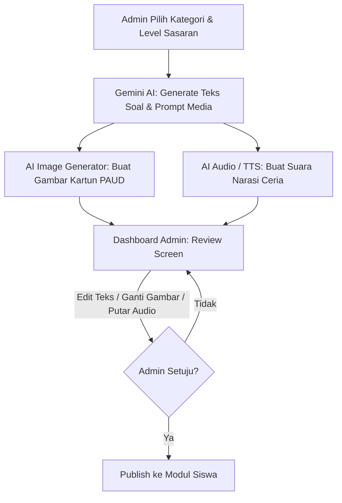

# 📄 Product Requirement Document (PRD)
# Platform Belajar & Kuis Bergambar Interaktif PAUD
**Nama Proyek**: YukBelajar PAUD  
**Target Pengguna**: Anak Usia Dini (PAUD / TK, Usia 3–6 Tahun), Orang Tua / Pendamping, & Guru / Administrator  
**Teknologi Utama**: Laravel 11 (PHP 8.4), Tailwind CSS v4, Alpine.js, Google Gemini AI (Multi-Modal: Teks, Gambar, Audio)  
**Status**: 100% Gratis & Edukasi Terbuka  

---

## 1. 📌 Ringkasan Eksekutif (Executive Summary)
**YukBelajar PAUD** adalah platform pembelajaran digital interaktif yang dirancang khusus untuk anak usia dini (3–6 tahun). Platform ini berfokus pada pendekatan **Visual-First dan Audio-Friendly** karena anak PAUD belum lancar membaca teks panjang. 

Platform ini dilengkapi dengan fitur **1-Click AI Generator (Google Gemini)** khusus untuk **Admin/Guru**, yang secara otomatis menghasilkan **Materi/Soal (Teks)**, **Gambar Ilustrasi Kartun (AI Image)**, dan **Suara Narasi (AI Audio / TTS)** dalam satu alur kerja yang cepat dan intuitif. Selain itu, platform menyediakan **Sistem Scaffolding Berjenjang (Level 1–3)**, **Portal Orang Tua dengan Parental Gate**, **Manajemen Pengguna CRUD**, **Manajemen Profil Akun Terpadu**, serta **Optimisasi Antarmuka Multi-Device** yang nyaman digunakan di smartphone, tablet/iPad, maupun komputer desktop.

---

## 2. 🎯 Tujuan Produk & Persona Pengguna

### 2.1. Tujuan Utama
1. Membantu anak usia dini belajar mengenal objek, huruf, angka, warna, bentuk, profesi, dan hewan secara menyenangkan.
2. Menyediakan kuis interaktif berbasis gambar dengan umpan balik (*feedback*) instan, efek suara ceria, dan reward bintang.
3. Mempermudah guru/admin membuat materi dan bank soal berkualitas tinggi secara otomatis menggunakan kecerdasan buatan (Google Gemini AI).
4. Menyediakan sistem registrasi mandiri yang ramah anak dengan pilihan avatar kartun lucu dan kustomisasi aksesori (*dress-up*).
5. Memberikan portal pemantauan transparan bagi orang tua untuk mengontrol kurikulum, akselerasi level anak cerdas, dan keamanan akun.
6. Menyediakan dashboard admin komprehensif dengan metrik analitik, status kesehatan API, audit trail, studio ekspor rapor belajar, dan CRUD manajemen pengguna.

### 2.2. User Persona & Hak Akses (Roles)

| Peran | Karakteristik & Kebutuhan | Hak Akses Fitur |
| :--- | :--- | :--- |
| **Anak / Siswa (PAUD)** | Belum bisa membaca lancar, menyukai warna cerah, animasi, audio suara, tombol sentuh besar. | Jelajah Flashcard, Dengar Suara Objek & Pelafalan TTS, Main Kuis Gambar, Ruang Piala Prestasi, Buku Stiker Virtual, Panggung Sahabat, Kustomisasi Profil & Avatar. |
| **Orang Tua / Pendamping** | Mendampingi anak belajar di rumah melalui HP/Tablet/Laptop. | Mendaftarkan akun anak, memilih avatar & aksesori, melihat statistik capaian, override kunci level kurikulum, mengganti PIN Orang Tua, mencetak sertifikat piagam kelulusan. |
| **Admin / Guru** | Pengelola kurikulum, kurator materi, dan pembuat bank soal. | **Akses Eksklusif Panel Admin**: Dashboard Analitik & Chart, 1-Click AI Gemini Generator, Manajemen Flashcard & Bank Soal, Manajemen Pengguna CRUD, Studio Ekspor Rapor Belajar PAUD (PDF/CSV), System Health Monitor, Audit Trail Logs, dan Pengaturan Profil Pengajar. |

---

## 3. 🎨 Rancangan Antarmuka & Kebutuhan Fungsional (UI/UX & Features)

### 3.1. Dashboard Siswa / Anak ("Taman Petualangan YukBelajar")
Antarmuka anak didesain dengan konsep **"Taman Petualangan Interaktif"** yang ceria, minim teks, kaya audio, dan memicu rasa ingin tahu anak usia 3–6 tahun.

* **Palet Warna Ceria**: *Sky Blue* (Langit Ceria), *Sunburst Yellow* (Kuning Matahari), *Minty Green* (Padang Rumput), *Bubblegum Pink*, dan *Royal Purple*.
* **Kebijakan Simbol & Ikon Positif**: Seluruh elemen visual menggunakan ikon bintang emas ⭐/🌟, roket 🚀, balon 🎈, dan piala 🏆 (*Bebas dari simbol pelangi untuk menjaga netralitas dan menghindari isu sosial sensitif*).
* **Tipografi Ramah Anak**: Font membulat (*Outfit & Quicksand*) berukuran besar dan terbaca jelas.
* **Efek Interaktif & Suara**: Tombol 3D kenyal (*bouncy buttons*), animasi awan melayang, maskot kartun penyapa (**"Kiki si Kucing Pintar" 🐱**), dan Web Audio synthesizer untuk efek keberhasilan belajar.

```
+---------------------------------------------------------------------------------------------+
|  🌟 YukBelajar PAUD        [⭐ 35 Bintang]  [🔊 Audio]  [🔒 Orang Tua]   [🦁 Guru]           |
|  [🎮 Petualangan] [🦖 Profil Alif] [🏆 Stiker] [🎖️ Ruang Piala] [👥 Sahabat]               |
+---------------------------------------------------------------------------------------------+
|                                                                                             |
|       🐱 "Halo Alif! (Usia 4 Tahun)"                                                        |
|       [⭐ 35 Bintang]   [🔊 Dengar Kiki]   [👤 Profil Saya]                                  |
|                                                                                             |
|   🎯 FILTER USIA & TINGKATAN:  [🌟 Semua]  [🌱 3-4 Thn (L1)]  [⭐ 4-5 Thn (L2)] [🚀 5-6 (L3)]  |
|                                                                                             |
|   🗺️ PILIH PULAU PETUALANGAN BELAJARMU:                                                      |
|                                                                                             |
|   +---------------------+   +---------------------+   +---------------------+               |
|   |   🦁 PULAU HEWAN    |   |  🔢 ISTANA ANGKA    |   |   🔤 TAMAN ABJAD    |               |
|   |   [Usia 3 - 5 Thn]  |   |  [Usia 3 - 6 Thn]   |   |   [Usia 4 - 6 Thn]  |               |
|   |   Progres Level:    |   |  Progres Level:     |   |   Progres Level:    |               |
|   |   [L1 🔓] [L2 🔓] [L3 🔒]|   [L1 🔓] [L2 🔒] [L3 🔒] |   [L1 🔓] [L2 🔓] [L3 🔒] |               |
|   |                     |   |                     |   |                     |               |
|   |   [▶️ Buka Kartu]    |   |   [▶️ Buka Kartu]    |   |   [▶️ Buka Kartu]    |               |
|   |   [🎯 Main Kuis]    |   |   [🎯 Main Kuis]    |   |   [🎯 Main Kuis]    |               |
|   +---------------------+   +---------------------+   +---------------------+               |
+---------------------------------------------------------------------------------------------+
```

---

### 3.2. Halaman Eksplorasi Materi & Bank Soal Multi-Mode (`/materi/{category}`)
Halaman materi dirancang dengan **3 Mode Tampilan Terintegrasi** untuk kebutuhan belajar mandiri, latihan kuis, dan review kelas:

1. **📚 Mode Katalog Materi (Full Grid Catalog)**:
   * Menampilkan seluruh kartu materi pada kategori yang dipilih.
   * Terklasifikasi dalam **Level 1 (Dasar)**, **Level 2 (Menengah)**, dan **Level 3 (Pra-SD)**.
   * Dilengkapi tombol instan **`🔊 Dengar Suara`** untuk mendengarkan pelafalan fonetik tanpa harus membuka mode penuh.
   * Tombol **`Buka Kartu ↗`** untuk melompat langsung ke kartu terkait pada mode belajar interaktif.
2. **🎯 Mode Bank Kuis & Soal (Quiz & Question Bank)**:
   * Menampilkan modul-modul kuis bergambar pada kategori terkait.
   * Menampilkan daftar butir pertanyaan, indikator reward bintang (⭐ 3 Bintang per modul), dan status kunci level.
   * Tombol aksi: **`▶️ Mulai Kuis Sekarang`** atau **`⚡ Buka Level Cerdas`**.
3. **▶️ Mode Belajar Layar Penuh (Interactive Jumbo Carousel)**:
   * Kartu flashcard jumbo berlatar gradien ceria.
   * Pelafalan audio otomatis dan tombol **`🔊 Dengar Pelafalan Suara`** + **`🎵 Tirukan Suara Objek`**.
   * Navigasi sentuh besar `[ ⬅️ Kartu Mundur ]` dan `[ Kartu Maju ➡️ ]` dengan dot indicator progres.
   * Kotak panduan belajar orang tua (*Pedagogical Parent Notes*) di bagian bawah.

---

### 3.3. Halaman Profil Siswa & Pengaturan Orang Tua (`/profil`)
Halaman profil terpadu untuk siswa dan orang tua dengan 3 tab pengaturan:

1. **🧒 Tab 1: Profil Anak, Avatar & Aksesori Dress-Up**:
   * Mengubah nama panggilan anak dan usia belajar PAUD (3, 4, 5, atau 6 tahun).
   * Pemilih 8 Avatar Kartun Hewan Lucu (*Dino 🦖, Kucing 🐱, Singa 🦁, Kelinci 🐰, Panda 🐼, Beruang 🐻, Gajah 🐘, Koala 🐨*).
   * Dress-Up Aksesori Juara (*Mahkota Emas 👑, Topi Pesta 🥳, Kacamata Pintar 👓, Jubah Pahlawan 🦸*).
2. **🔒 Tab 2: PIN & Keamanan Akun**:
   * Mengubah username unik akun siswa.
   * Mengubah 4 digit PIN Orang Tua (*Parental Gate Security*).
   * Mengatur kata sandi akun baru.
3. **🔊 Tab 3: Suara & Efek Animasi**:
   * Pengatur kecepatan suara pelafalan TTS Bahasa Indonesia (*0.7x – 1.3x*).
   * Saklar aktif/non-aktif efek suara kemenangan (*victory chimes*).
   * Saklar aktif/non-aktif efek animasi hujan konfeti bintang.

---

### 3.4. Portal Khusus Orang Tua (`/orang-tua`)
Akses ke menu orang tua dilindungi oleh **Parental Gate Dinamis** (pertanyaan matematika sederhana seperti *"Berapa 4 + 3?"*):
* **Ringkasan Aktivitas**: Total bintang, kuis ditamatkan, flashcard dibuka, dan streak hari belajar berturut-turut.
* **Tingkat Penguasaan Materi (Topic Mastery)**: Progress bar persentase pemahaman di setiap pulau belajar.
* **Manajer Kunci Kurikulum (Curriculum Level Lock Manager)**: Opsi saklar untuk mengunci/membuka Level 2 dan Level 3 secara manual, atau mengaktifkan mode *Buka Semua Level*.
* **Akses Cepat Studio Piagam Sertifikat**: Navigasi langsung ke studio sertifikat kelulusan anak siap cetak.

---

### 3.5. Dashboard Admin & Guru (`/admin`)
Dashboard admin tingkat enterprise yang bersih, analitik, dan terstruktur untuk memantau pembelajaran dan mengelola sistem:

```
+---------------------------------------------------------------------------------------------+
|  🦁 YukBelajar Admin      [🚀 Lihat Web Siswa]               [🔔] [GI Pak Guru Iqbal]        |
|  [📊 Dashboard] [✨ 1-Click AI] [📚 Flashcard] [🎯 Bank Soal] [🏆 Stiker] [👥 Users] [⚙️ Profil]|
+---------------------------------------------------------------------------------------------+
|  🟢 STATUS SISTEM & API:                                                                    |
|  • Google Gemini: [🟢 Gemini 2.0 Flash]  • Kuota AI: [850 / 1000 Harian]                    |
|  • Web Speech TTS: [🟢 ID-ID Aktif]     • Parental Gate: [🟢 4-Digit PIN Aktif]             |
|                                                                                             |
|  📊 RINGKASAN & ANALITIK:                                                                   |
|  [📚 45 Flashcard]   [🎯 28 Kuis Bergambar]   [👶 120 Siswa Aktif]   [⭐ 1.4K Bintang Emas] |
|                                                                                             |
|  📈 GRAFIK ANALITIK SISWA:                                                                  |
|  • Aktivitas Mingguan (Bar Chart: Kuis Diselesaikan vs Bintang Diraih per Hari)             |
|  • Tingkat Ketuntasan Materi per Pulau / Kategori (Progress Bar %)                          |
|                                                                                             |
|  🗂️ PENGKATEGORIAN & TINGKATAN LEVEL MATERI:                                                |
|  [🦁 Pulau Hewan]  [🔢 Istana Angka]  [🔤 Taman Abjad]  [🍎 Buah]  [🎨 Warna]  [🚗 Kendaraan]|
|  +---------------------------------------------------------------------------------------+  |
|  | Level 1: Dasar / Pemula (Usia 3-4 Thn) -> [3 Kartu Flashcard]   [➕ Tambah] [✏️] [🗑️]   |  |
|  | Level 2: Menengah / Eksplorasi (4-5 Thn) -> [2 Kartu Flashcard] [➕ Tambah] [✏️] [🗑️]   |  |
|  | Level 3: Pra-SD / Mahir (5-6 Thn)        -> [2 Kartu Flashcard] [➕ Tambah] [✏️] [🗑️]   |  |
|  +---------------------------------------------------------------------------------------+  |
|                                                                                             |
|  📜 STUDIO EKSPOR RAPOR BELAJAR PAUD:                                                       |
|  • Siswa: [Alif Rahman v]  • Format: [📑 PDF Resmi / 📊 CSV Spreadsheet] [📥 Unduh Rapor]  |
|                                                                                             |
|  ⏱️ RIWAYAT AKTIVITAS SISTEM (LIVE AUDIT TRAIL):                                            |
|  • [Kuis] Alif Rahman menamatkan Kuis Tebak Hewan (Skor: 100% ⭐⭐⭐) - 5 mnt lalu          |
|  • [AI Engine] Generator membuat 4 kartu baru: Satwa Laut Ceria - 25 mnt lalu               |
|  • [Fast Unlock] Nayla membuka tantangan cerdas Level 3 Istana Angka - 1 jam lalu          |
+---------------------------------------------------------------------------------------------+
```

#### Fitur Utama Dashboard Admin:
1. **System Health Bar**: Pemantauan langsung status AI model (`Gemini 2.0 Flash`), pemakaian kuota API harian, engine TTS, dan modul keamanan.
2. **Grafik Analitik Interaktif**: Bar chart capaian belajar mingguan dan bar progres ketuntasan materi per kategori.
3. **Pengkategorian & Level Scaffolding**: Manajemen kartu flashcard per level usia dengan modal tambah/edit kartu.
4. **Studio Ekspor Rapor Belajar PAUD**: Generator unduhan rapor perkembangan kognitif siswa dalam format PDF atau CSV.
5. **System Audit Trail Logs**: Log riwayat kejadian penting (penyelesaian kuis, fast-unlock, pembuatan materi AI, dan perubahan data).

---

### 3.6. Panel Manajemen Pengguna CRUD (`/admin/users`)
Halaman pengelolaan pengguna lengkap bagi administrator untuk mengelola siswa, orang tua, dan pengajar:
* **Kartu Metrik Pengguna**: Total Siswa, Total Orang Tua, Guru/Admin, dan Pengguna Aktif Hari Ini.
* **Fitur Pencarian & Multi-Filter**: Pencarian berdasarkan nama, username, email; filter role (*Semua, Siswa, Orang Tua, Guru*); filter status (*Aktif / Non-aktif*).
* **Tabel Interaktif & Tindakan Cepat**:
  * **Tambah Pengguna Baru**: Modal form dengan pemilih avatar kartun, input nama lengkap, username, role, usia belajar, PIN orang tua, dan kata sandi.
  * **Edit Pengguna**: Modal formulir modifikasi data akun.
  * **Reset PIN / Password**: Tombol cepat untuk mereset PIN Parental Gate siswa ke default (`1234`) atau kata sandi pengajar.
  * **Toggle Status & Hapus Akun**: Mengaktifkan/menonaktifkan akun atau menghapus data secara aman dengan konfirmasi dialog.

---

### 3.7. Halaman Profil Pengajar & Pengaturan Admin (`/admin/profil`)
Halaman profil khusus pengajar/administrator:
* **Data Diri & Profil Pengajar**: Nama lengkap, gelar, username, email resmi lembaga, nama sekolah/instansi PAUD, dan nomor kontak WhatsApp.
* **Keamanan & Password Admin**: Form ganti kata sandi admin (kata sandi lama, baru, dan konfirmasi).
* **Konfigurasi AI & Sistem**: Pemilihan model utama Google Gemini AI (*Gemini 2.0 Flash / Gemini 1.5 Flash / Gemini 1.5 Pro*) serta verifikasi status aktif `GEMINI_API_KEY`.

---

## 4. 🤖 Fitur Multi-Modal Gemini AI (Khusus Admin / Guru)

Fitur ini **hanya dapat diakses oleh Admin/Guru** melalui panel dashboard untuk mengotomatiskan pembuatan materi dan soal kuis:



### 4.1. Komponen AI
1. **Gemini Text Generation (`gemini-2.0-flash` / `gemini-1.5-flash`)**:
   * Menghasilkan struktur JSON soal ramah anak (pertanyaan, opsi jawaban, kunci jawaban, dan naskah narasi).
   * *System Prompt* dikunci dengan standar pedagogi anak usia 3–6 tahun.
2. **AI Image Generation**:
   * Menghasilkan ilustrasi kartun 3D/vektor ramah anak berlatar bersih berdasarkan prompt dari Gemini.
3. **AI Audio / Text-to-Speech (TTS)**:
   * Mengubah teks soal dan narasi menjadi pelafalan audio berbahasa Indonesia dengan nada ramah, santun, dan bersemangat.

---

## 5. 🏗️ Arsitektur Teknis & Database

### 5.1. Tech Stack
* **Backend Framework**: Laravel 11 (PHP 8.4)
* **Frontend**: Blade + Tailwind CSS v4 + Alpine.js + Canvas-Confetti
* **Database**: **MySQL 8.0+ / MariaDB** (Default Character Set: `utf8mb4`, Collation: `utf8mb4_unicode_ci` untuk dukungan emoji penuh 🦁⭐🦖)
* **Audio & Speech**: Web Audio API Synthesizer + Web Speech API (Indonesian `id-ID` Voice)
* **AI Provider**:
  * **Text & Prompts**: Google Gemini API (`gemini-2.0-flash` / `gemini-1.5-flash`)
  * **Image Generator**: Google Imagen 3 (via Gemini API) / Local Fallback SVG Assets
  * **Audio / TTS**: Google Cloud TTS / Web Speech API Fallback
* **Code Formatting**: Laravel Pint (PSR-12 Standard)
* **Testing**: Pest PHP Test Suite (Compact Mode)

### 5.2. Skema Tabel Database (MySQL)

```mermaid
erDiagram
    USERS ||--o{ QUIZ_ATTEMPTS : has
    USERS ||--o{ USER_STICKERS : collects
    USERS ||--o{ USER_MATERIAL_PROGRESS : tracks
    USERS ||--o{ USER_ACHIEVEMENTS : earns
    USERS ||--o{ USER_LEVEL_PROGRESS : tracks
    USERS ||--o{ COMMUNITY_CHEERS : gives_receives
    USERS ||--o{ AUDIT_LOGS : performs
    ACHIEVEMENTS ||--o{ USER_ACHIEVEMENTS : awarded_in
    CATEGORIES ||--o{ LEARNING_LEVELS : contains
    LEARNING_LEVELS ||--o{ MATERIALS : contains
    LEARNING_LEVELS ||--o{ QUIZZES : contains
    QUIZZES ||--o{ QUESTIONS : has
    QUESTIONS ||--o{ QUESTION_OPTIONS : has
    QUIZZES ||--o{ QUIZ_ATTEMPTS : records
    STICKERS ||--o{ USER_STICKERS : awarded_as

    USERS {
        bigint id PK "AUTO_INCREMENT"
        string username "Username unik login"
        string password "Hashed Password"
        string name "Nama Anak / Guru"
        string email "Email (Guru/Admin/Ortu)"
        enum role "admin, student, parent, teacher"
        string avatar_icon "Key emoji/icon avatar"
        string avatar_accessory "Key aksesori mahkota/topi"
        tinyint age "Usia anak (3-6 tahun)"
        string parent_pin "4-digit PIN Parental Gate"
        string school_name "Nama sekolah/PAUD (khusus guru)"
        string phone "No telepon/WhatsApp"
        integer total_stars "Total perolehan bintang emas"
        boolean is_active "Status aktif akun"
        timestamps created_at_updated_at
    }

    CATEGORIES {
        bigint id PK "AUTO_INCREMENT"
        string name "Nama Kategori (Pulau Hewan, dll)"
        string slug "Unique slug"
        string icon_emoji "Emoji icon utama"
        string color_theme "sky, yellow, emerald, purple, etc"
        string bg_gradient "Class gradient Tailwind"
        integer sort_order "Urutan tampilan"
        timestamps created_at_updated_at
    }

    LEARNING_LEVELS {
        bigint id PK "AUTO_INCREMENT"
        bigint category_id FK "REFERENCES categories(id) ON DELETE CASCADE"
        string title "Contoh: Level 1 - Dasar"
        integer level_number "1, 2, 3"
        tinyint target_age "Target usia: 3, 4, 5, 6"
        integer unlock_stars_required "Syarat bintang buka kunci"
        text description "Keterangan capaian level"
        timestamps created_at_updated_at
    }

    MATERIALS {
        bigint id PK "AUTO_INCREMENT"
        bigint learning_level_id FK "REFERENCES learning_levels(id) ON DELETE CASCADE"
        string title "Nama Objek (e.g. Singa, Gajah)"
        string subtitle "Deskripsi fonetik / suku kata"
        string icon_emoji "Emoji visual objek"
        string sound_effect "Path efek suara tiruan"
        text speech_text "Teks pelafalan suara TTS"
        text parent_note "Catatan panduan orang tua"
        integer sort_order "Urutan kartu"
        timestamps created_at_updated_at
    }

    QUIZZES {
        bigint id PK "AUTO_INCREMENT"
        bigint learning_level_id FK "REFERENCES learning_levels(id) ON DELETE CASCADE"
        string title "Judul Kuis Bergambar"
        string slug "Unique slug"
        string icon_emoji "Cover emoji kuis"
        tinyint target_age "Target usia"
        integer total_questions "Jumlah butir soal"
        timestamps created_at_updated_at
    }

    QUESTIONS {
        bigint id PK "AUTO_INCREMENT"
        bigint quiz_id FK "REFERENCES quizzes(id) ON DELETE CASCADE"
        text question_text "Teks pertanyaan ramah anak"
        string question_audio "Teks/file suara soal"
        string question_emoji "Gambar icon bantuan"
        integer sort_order "Nomor soal"
        timestamps created_at_updated_at
    }

    QUESTION_OPTIONS {
        bigint id PK "AUTO_INCREMENT"
        bigint question_id FK "REFERENCES questions(id) ON DELETE CASCADE"
        string option_emoji "Emoji kartu opsi"
        string option_text "Label teks opsi"
        boolean is_correct "Jawaban benar (1) / salah (0)"
        integer sort_order "Urutan posisi"
        timestamps created_at_updated_at
    }

    QUIZ_ATTEMPTS {
        bigint id PK "AUTO_INCREMENT"
        bigint user_id FK "REFERENCES users(id) ON DELETE CASCADE"
        bigint quiz_id FK "REFERENCES quizzes(id) ON DELETE CASCADE"
        integer score "Skor persentase (0 - 100)"
        integer total_correct "Total jawaban benar"
        integer total_questions "Total butir soal"
        tinyint stars_earned "Bintang diraih (1 - 3)"
        datetime completed_at
        timestamps created_at_updated_at
    }

    STICKERS {
        bigint id PK "AUTO_INCREMENT"
        string name "Nama Karakter Stiker"
        string emoji "Emoji karakter stiker"
        string category "Kategori stiker"
        string rarity "common, rare, legendary"
        text description "Pesan apresiasi stiker"
        timestamps created_at_updated_at
    }

    USER_STICKERS {
        bigint id PK "AUTO_INCREMENT"
        bigint user_id FK "REFERENCES users(id) ON DELETE CASCADE"
        bigint sticker_id FK "REFERENCES stickers(id) ON DELETE CASCADE"
        datetime earned_at
        timestamps created_at_updated_at
    }

    ACHIEVEMENTS {
        bigint id PK "AUTO_INCREMENT"
        string code "Unique code lencana"
        string title "Judul Lencana / Gelar Juara"
        string description "Syarat perolehan"
        string icon_badge "Icon Lencana"
        enum target_type "student, parent"
        string reward_type "stars, accessory, certificate"
        string reward_value "Nilai hadiah"
        timestamps created_at_updated_at
    }

    USER_ACHIEVEMENTS {
        bigint id PK "AUTO_INCREMENT"
        bigint user_id FK "REFERENCES users(id) ON DELETE CASCADE"
        bigint achievement_id FK "REFERENCES achievements(id) ON DELETE CASCADE"
        integer current_progress "Progres capaian"
        boolean is_unlocked "Status tercapai (1) / terkunci (0)"
        datetime unlocked_at
        timestamps created_at_updated_at
    }

    AUDIT_LOGS {
        bigint id PK "AUTO_INCREMENT"
        bigint user_id FK "REFERENCES users(id) NULLABLE"
        string action_type "quiz, ai, level_unlock, user_crud"
        string description "Keterangan detail aktivitas"
        string ip_address "IP pengakses"
        timestamps created_at
    }
```



---

## 6. 📱 Standar Responsivitas Multi-Device & Kualitas UX PAUD

Platform dirancang dan telah dioptimalkan secara mendalam agar **100% responsif dan bebas dari masalah overflow / overlapping** di semua ukuran layar:

| Perangkat | Resolusi Layar | Adaptasi Tata Letak & Optimasi UX |
| :--- | :--- | :--- |
| 📱 **Mobile Smartphone** | *360px – 480px* | • **Header Navigasi 2-Baris**: Top bar ringkas + sub-bar horizontal scrollable menu strip (`no-scrollbar`) untuk navigasi game tanpa tumpukan teks.<br>• **Touch Target Jumbo**: Tombol berukuran minimal $48\text{px} \times 48\text{px}$ dengan padding luas agar jemari anak tidak salah tekan.<br>• **Grid Adaptif**: Kartu pulau dan kuis disusun 1 kolom fleksibel yang mengisi layar secara nyaman. |
| 📱 **Tablet / iPad** | *768px – 1024px* | • **Perangkat Belajar Paling Direkomendasikan untuk PAUD**.<br>• Grid 2 s/d 3 kolom lapang dan imersif.<br>• Kartu materi terasa seperti membuka buku cerita interaktif digital dengan ukuran tipografi besar dan visual jelas.<br>• Sidebar admin otomatis menyesuaikan menjadi menu kartu ringkas. |
| 💻 **Desktop / Laptop** | *1280px+* | • **Untuk Siswa**: Tampilan game dengan batas container tengah (*centered wrapper*) dan aksen dekoratif yang seimbang.<br>• **Untuk Guru/Admin**: Tampilan dashboard luas dengan visualisasi grafik, tabel data pengguna, dan status API real-time. |

---

## 7. 🛣️ Status Pengembangan & Roadmap Fitur

- [x] **Desain Sistem & Antarmuka Ceria**: Palet warna cerah, tipografi Outfit & Quicksand, tombol 3D kenyal, eliminasi total simbol pelangi untuk netralitas konten.
- [x] **Landing Page, Registrasi & Login Mandiri**: Username generator ramah anak, login mode Siswa dan mode Guru/Orang Tua.
- [x] **Web Audio & Speech Engine**: Synthesizer nada kemenangan, efek suara tiruan objek, dan Web Speech TTS bahasa Indonesia ceria.
- [x] **Katalog Materi & Bank Kuis Multi-Mode (`/materi/{category}`)**: Mode Katalog Materi Grid, Mode Bank Kuis & Soal, serta Mode Belajar Layar Penuh Jumbo.
- [x] **Sistem Scaffolding Berjenjang & Smart Fast-Unlock**: Level 1 (Dasar), Level 2 (Menengah), Level 3 (Pra-SD), Filter Usia Dinamis, dan Tantangan Akselerasi Anak Cerdas (`⚡ Uji Cepat`).
- [x] **Portal Orang Tua (`/orang-tua`)**: Proteksi Parental Gate, statistik penguasaan topik, dan manajer override kunci kurikulum mandiri.
- [x] **Ruang Piala Prestasi & Studio Sertifikat (`/prestasi`)**: Lencana gelar juara siswa & orang tua + piagam kelulusan siap cetak (*Printable Certificate Studio*).
- [x] **Buku Stiker Virtual (`/buku-stiker`)**: 12 koleksi stiker karakter hewan & profesi dengan status terkunci/terbuka.
- [x] **Panggung Sahabat Petualang (`/sahabat`)**: Komunitas positif pengganti leaderboard kaku dengan apresiasi ceria (*Friendly Cheers*) dan tabung bintang bersama.
- [x] **Panel Manajemen Pengguna CRUD (`/admin/users`)**: Metrik pengguna, pencarian & filter role, modal form Tambah/Edit, Reset PIN, dan status toggle.
- [x] **Dashboard Enterprise Guru/Admin (`/admin`)**: System health monitor real-time, grafik analitik mingguan, studio ekspor rapor belajar PAUD (PDF/CSV), dan live audit trail logs.
- [x] **Profil Akun Terpadu (`/profil` & `/admin/profil`)**: Pengaturan nama, usia belajar, avatar dress-up, PIN Parental Gate, kata sandi, dan preferensi model Google Gemini AI.
- [x] **Optimisasi Multi-Device & Mobile/Tablet**: Navigasi 2-baris responsif, swipeable menu pills, zero-overlap layout di semua breakpoint layar.
- [ ] **Migrasi Database MySQL & Seeder Otomatis**: Eksekusi skema database relasional lengkap di lingkungan produksi MySQL.
- [ ] **Integrasi Google Gemini API Live Multi-Modal**: Penyambungan kunci API Gemini untuk pembuatan modul baru secara otomatis dari panel admin.
